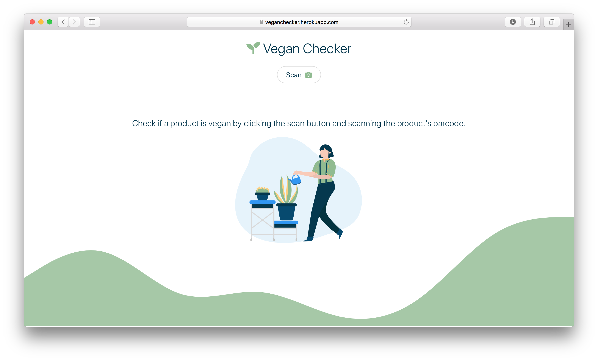
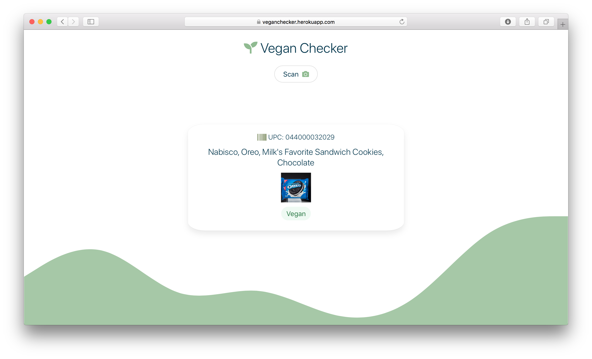

# Vegan Checker
A web application that allows users to scan a food product's barcode and check if it is vegan.

### Built With
* [**React**](https://reactjs.org) - Frontend
* [**Node.js**](https://nodejs.org/en/) - Backend
* [Express.js](https://expressjs.com) - Node.js framework
* [QuaggaJS](https://serratus.github.io/quaggaJS/) - Barcode library
* [Edamam API](https://www.edamam.com) - Food API
* [Bulma](https://bulma.io) - UI framework

## Demo

This application is currently deployed on Heroku at https://veganchecker.herokuapp.com.

## License
Released under the MIT License. See `LICENSE` for more information.

## Acknowledgments
* [Illustration](https://delesign.com/free-designs/graphics)
* [react-bulma-components](https://react-bulma.dev/en)
* [react-loading](https://www.npmjs.com/package/react-loading)
